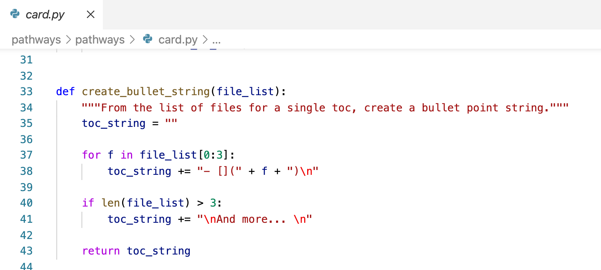

# User Guide for Turing Way Pathways

The Turing Way now has curated pages for different users, known as Pathways. 

 

_The panel on the Welcome Page for the Turing Way._

---


_Each pathway has a landing page with links to specified pages across the Turing Way._ 


---


_Each page has a tag showing which pathway it belongs to, which links back to the landing page._ 


## How to Add a New Pathway

A new pathway, also known as user profile, is a curated table of contents for a specific user of the Turing Way. A landing page links to the different pages this user can browse in order. As the Turing Way is a large book, this provides a simpler entry point. 


### Find the profiles.yaml file

Go to `/master/profiles.yml`


This YAML file defines which pages are included for different "user profiles". 

### Add new user profile/pathway

`- name: ` defines the user profile or pathway name. 

### Include pages
The relative paths for each of the pages from the Turing Way are included under `files:`. Relative links follow the directory structure of the original markdown files, and are equivilent syntax to including links to other pages in markdown.

>**Important:** You cannot have a page without its parents or it will not appear in the landing page. So it is not possible to have `communications/comms-overview/comms-overview-principles` without `communications/comms-overview/`. Orphan pages will be tagged. 

### Decide the colour
`colour:` defines the colour of the card and the tag button that appears on every included page.


All CSS colour names should be supported. 


## Part 02: The Card Panel on the Welcome Page


### Default behaviour

When running the scripts to create the Turing Way html files, the script `main.py` is called, which uses the table of contents defined in the `profiles.yml` file to generate a _landing page_ for each profile/pathway. 

In addition, a series of cards are produced on the main Welcome Page to the Turing Way with a preview of each pathway and its included pages. 

Currently, the cards are created under the heading _Different Pathways_. 

### Changing where the cards appear

The script `pathways/pathways/card.py` looks for a specified line of text in the Welcome Page markdown file and inserts the card panels after it. 

Currently, the cards are created under the heading _## Different Pathways_.


Which looks for the string within the markdown file (highlighted on Line 28):


Alter both these files to change where the card panel appears on the Welcome Page, or otherwise when the "Different Pathways" heading is edited. 

>**Important:** Also change the string in the `bio-turingway/pathways/tests/test_card.py` to make sure the test passes.  
>
> Changing this will require reinstallation of the dependencies, see "Part 03 - Dependencies and Library Install" below for futher details. 

### How many pages linked in each card

Currently the first four pages for each profile/pathway are linked within the card. Pages after this are not included. 

To alter the number of included pages in the card, look for a function within `card.py` called `create_bullet_string` and change the number in the `for` (Line 37) and `if` (Line 40) from 3 to another value. 




### Edit the appearance of the cards and the panel

Within `card.py`, edits can be made to change the appearance of the cards and panels. You can find the guidelines for this in the following documentation:

https://sphinx-panels.readthedocs.io/en/latest/#card-layout

For example, edit these properties in the function `create_panel`. 


## Part 03: Running the Script and Tests

### Python version and environment 
The scripts use Python version 3.8 and other versions are not yet compatible. 

The steps to create a virtual environment using conda in the terminal are as follows:

```
conda create -n turing-persona python=3.8
conda activate turing-persona
```
However, the python environment can be created with poetry or venv or similar, depending on preference. 

### Dependencies and Library Install

To install the dependencies and the `pathways` library then also run in the terminal: 

```
pip install pathways/
pip install -r master/requirements.txt
```
> **Important:** If `main.py` or `card.py` are edited these dependencies need to be reinstalled. For example, when changing the location of the card panels in `card.py`. (This is not necessary if the `profiles.yml` file has been edited)
>
>Run `pip uninstall pathways` first and then run the above lines again.  

### Creating the Turing Way JupyterBook  
Finally, to run the Jupyter book and create the different pathways, then run the following:

`python -m pathways.main pathways master`

This will produce the landing pages, and the welcome page with the pathway cards. The individual pages within the Turing Way will also be tagged. 

### Running Tests

To run the tests, in the terminal navigate to `bio-turingway/pathways/` and then run:

`./run_tests.sh`

and 

`pre-commit run [hook-id]`


